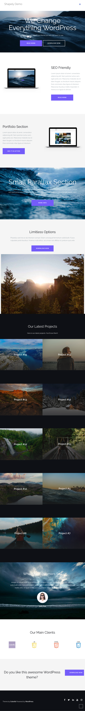
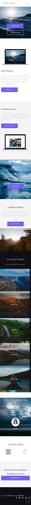

# Shapely Landing Page

## Über das Projekt

Dies ist eine Landingpage, die mit **HTML** und **CSS** basierend auf der Vorlage [Shapely](https://colorlibhub.com/shapely/) erstellt wurde. Die Seite wurde so gestaltet, dass sie sich dank **Media Queries** an verschiedene Bildschirmgrößen anpasst, um eine optimale Darstellung auf Desktop, Tablet und Smartphone zu gewährleisten.

## Technologien

- HTML
- CSS (inklusive Media Queries für responsives Design)

## Responsive Design

Die Webseite passt sich automatisch an verschiedene Bildschirmgrößen an. Durch den Einsatz von **Media Queries** wird sichergestellt, dass die Darstellung sowohl auf **Mobilgeräten** als auch auf **Tablets** optimal funktioniert. Dies verbessert die Benutzererfahrung auf allen Endgeräten.

## Vorschau

### Desktop-Version

.png>)

### Tablet-Version

### Mobile-Version

